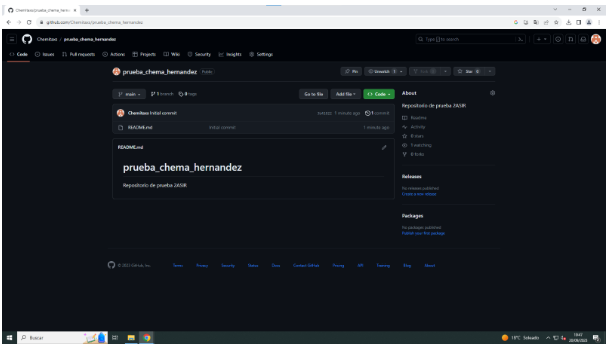
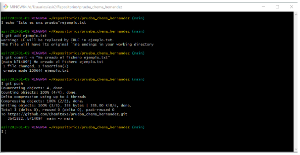
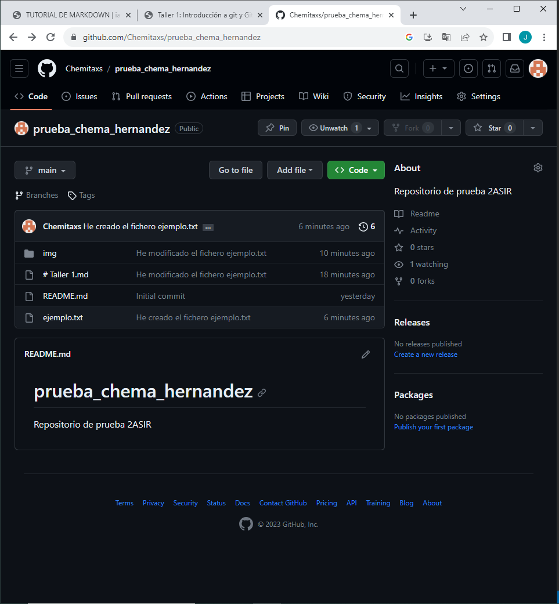
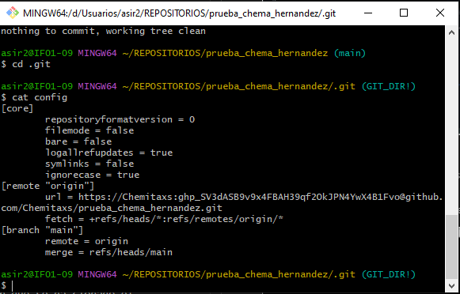
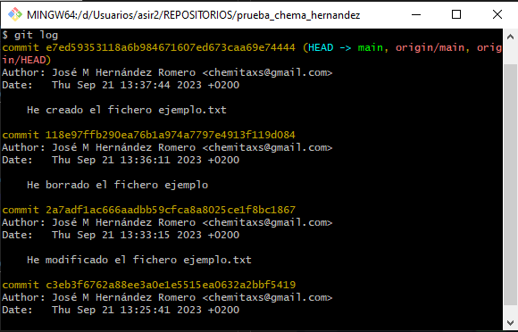
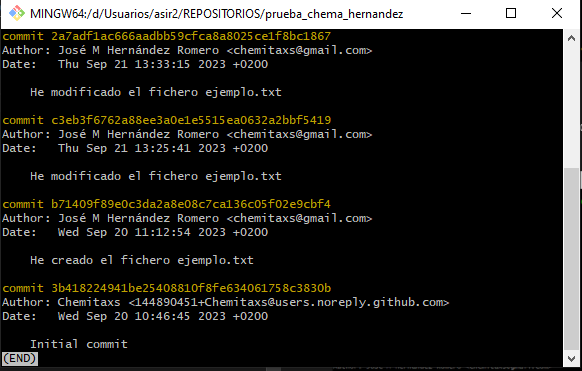

# Tutorial Dockers

Primero creamos un repositorio en el Git Bash conectado a nuestra Debian por SSH.  



Una vez creado tenemos que usar el siguiente comando para crear la estructura de directorios y los archivos necesarios de un nuevo proyecto Jekyll.

``` 
docker run -it --rm -v "$PWD:/srv/jekyll" jekyll/jekyll jekyll new blog
 ```



Ahora tenemos que acceder a la carpeta blog que se ha creado en nuestro repositorio y añadir al documento Gemfiles la siguiente linea al final.

``` 
gem "webrick"
 ```



A continuación tenemos que ejecutar el siguiente comando dentro de la carpeta blog.



Una vez terminada esta tarea, tenemos que usar otro comando que nos permita generar un sitio HTML estático a partir del contenido del proyecto Jekyll.

``` 
docker run -it --rm -p 4000:4000 -v "$PWD:/srv/jekyll" jekyll/jekyll jekyll serve --force_polling
 ```



La opción de **--force_polling** permite que el contenido del sitio se vaya generando automáticamente cuando existe algún cambio en los archivos del proyecto.  
Con esto ya tendremos en funcionamiento nuestro sitio Jekyll.
 Solo falta ver nuestro sitio web abriendo un navegador web y accediendo a la dirección del servidor en el puerto 4000.

