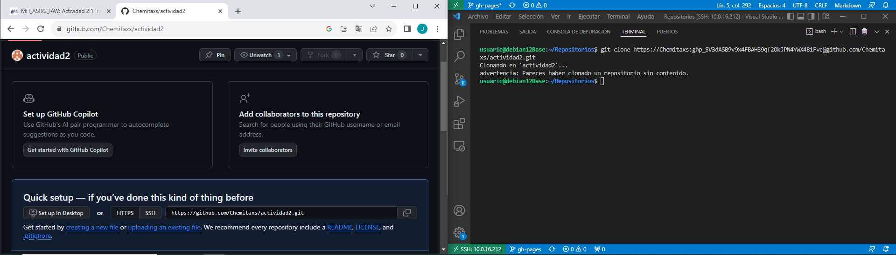
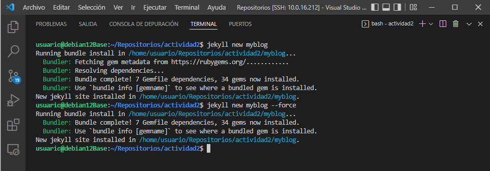

# Ejercicio 2 Instalación y configuración CMS

## 1ª PARTE

Primero tenemos que crear un repositorio remoto en nuestro github, llamado actividad2. Una vez creado haremos un git clone en nuestra maquina Debian, pero desde el interfaz de Visual Studio Code ya que hicimos una conexión ssh por lo que tenemos acceso al terminal de Debian desde el Visual.



Una vez hecho esto tenemos al haber creado un repositorio nuevo, creamos la rama gh-pages y nos cambiamos a dicha pagina.


A continuación crearemos nuestro propio sitio en jekyll , para ello creamos el fichero myblog y generaremos dentro el sitio jekyll, el cual por defecto usa el tema llamado **Mínima**.



Ahora solo falta probar el sitio de forma local, para ello iniciamos el sitio con el siguiente comando:  
``` 
bundle exec jekyll serve --host 10.0.16.212
 ```
Ahora tenemos que ir al navegador de nuestro equipo local y comprobar que se esta ejecutando, para ello ponemos lo siguiente en el buscador: ```http://10.0.16.212:4000``` y vemos lo que nos aparece.


